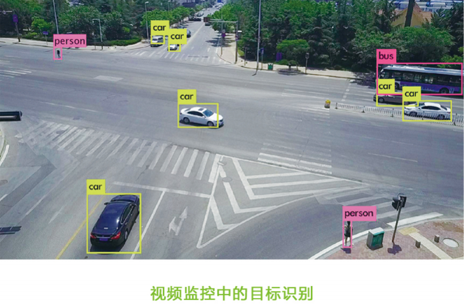
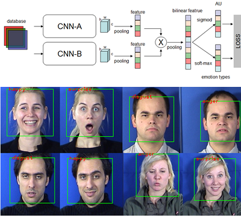
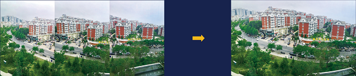

于腾课题组科研课题

#### 个人介绍

<a href="/index-cn.html">点击此处</a>

#### 基于计算机视觉的无人驾驶相关技术

- 车辆和行人自动检测（Vehicle and Pedestrian Detection）

- 路标自动识别（Road Marking Detection）

- 疲劳驾驶智能检测（Yawning Detection）

#### 通用图像处理与识别技术

- 常见目标识别

- 基于深度学习的表情识别（Emotion Recognition）

- 图像去雾霾（Image Dehazing）

- 全景图拼接（Panorama）

- HDR成像和色调映射（HDR Imaging and Tone Mapping）

#### 基于视觉的智能安防技术研究

- 火灾检测（Fire Flame and Smoke Detection）
- 人群密度监控（Dense Crowd Counting）
- 监控异常检测（Anomaly Detection in Surveillance Videos）
